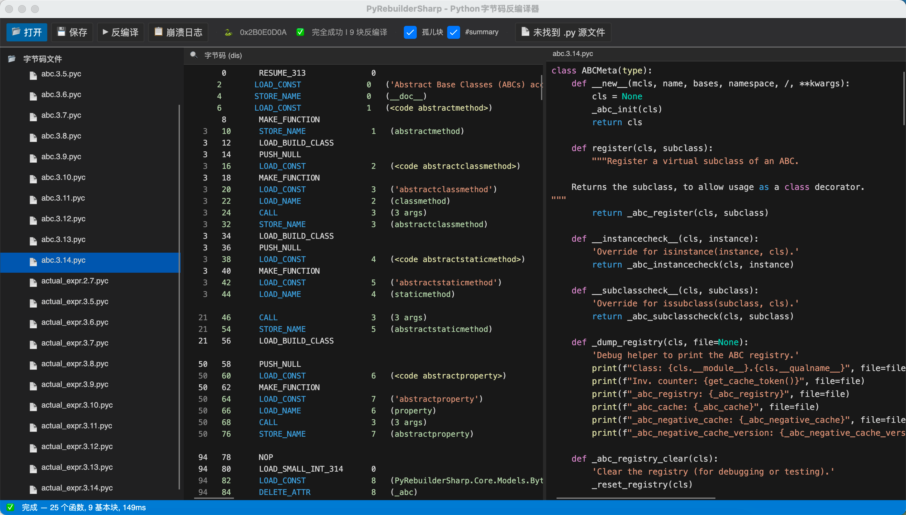
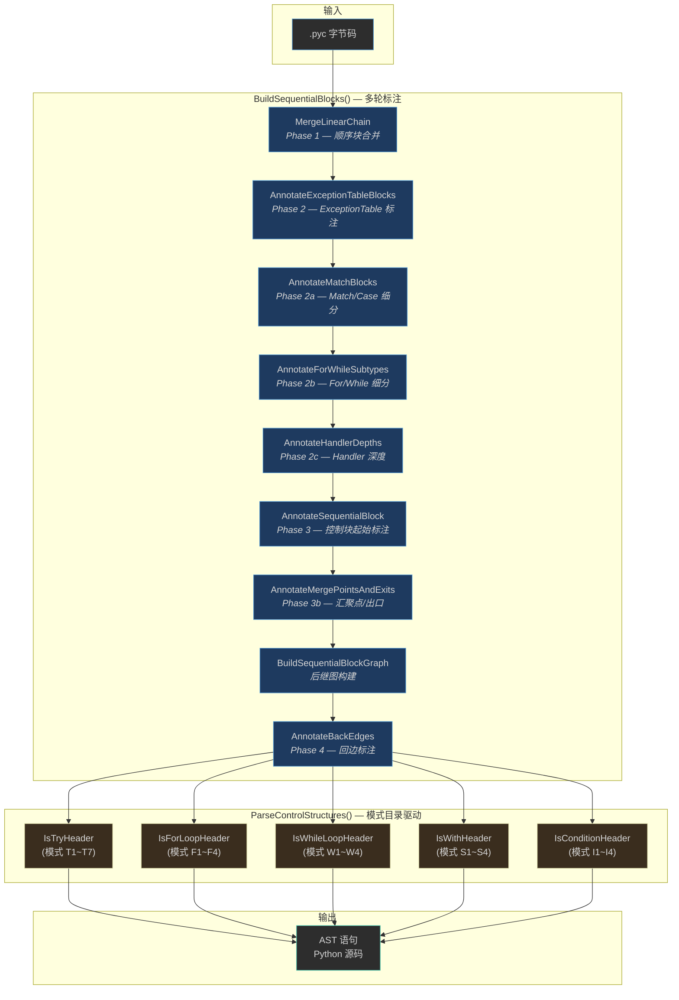
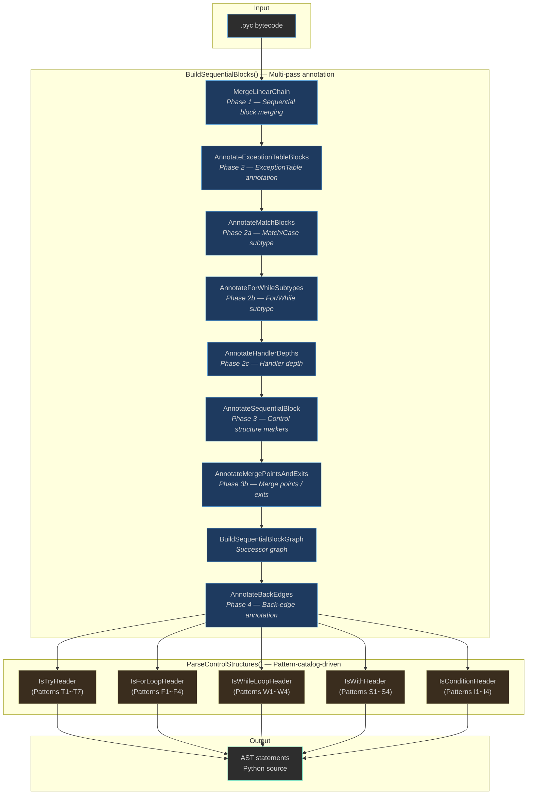

# PyRebuilderSharp 🐍⚡

> **逐块重建，完整还原 · Block-by-block recovery, complete restoration**
> 
> **块级容错 · 极致压缩失败率 · 比AI更可控**
> **Block-level fault tolerance · Minimal failure rate · More controllable than AI**

[🇨🇳 中文](#中文) | [🇬🇧 English](#english)

---

<a id="中文"></a>

# 🇨🇳 中文

> 一个 Python 字节码反编译器 —— 基于 .NET 10 + Avalonia UI · Python 2.7 ~ 3.14 · 跨平台

---


*GUI 界面：左侧文件树 → 中侧字节码（语法高亮）→ 右侧源码（VS Code 风格配色 + 双向滚动锁定）*

## 我们的成果

**PyRebuilderSharp** 是一个从零构建的 Python 字节码反编译器，使用 C# 13 + .NET 10 + Avalonia UI，全栈自主实现（0 行第三方反编译依赖）。对标业界主流 pycdc（C++），在架构和稳健性上实现了根本性超越。

### 最新进展 — Phase 7: 标注优先 + 控制块模式目录 🚀

Phase 7 引入全新的 `--seq-blocks` 反编译架构，以**标注优先 + 模式目录驱动**为原则。先多轮扫描收集标注信息，再按模式目录的确定性顺序统一链接：

```
BuildSequentialBlocks():
├── MergeLinearChain                    ← Phase 1 顺序块构建
├── AnnotateSequentialBlock             ← Phase 3 控制块起始标注
├── AnnotateExceptionTableBlocks        ← Phase 2 ExceptionTable 标注
├── AnnotateMatchBlocks                 ← Phase 2a Match/Case 标注
├── AnnotateForWhileSubtypes            ← Phase 2b For/While 细分
├── AnnotateHandlerDepths               ← Phase 2c Handler 深度
├── BuildSequentialBlockGraph           ← 后继图
├── AnnotateMergePointsAndExits         ← Phase 3b 汇聚点/出口
└── AnnotateBackEdges                   ← Phase 4 回边

ParseControlStructures():               ← Phase 5 模式目录驱动链接
├── Try  (IsTryHeader)                  → 模式 T1-T7
├── Loop (IsForLoopHeader/IsWhileLoopHeader) → 模式 F1-F4/W1-W4
├── With (IsWithHeader)                 → 模式 S1-S4
└── IfElse (IsConditionHeader)          → 模式 I1-I4
```



| 关键指标 | 数值 | 状态 |
|---------|------|:----:|
| 孤儿块 | **0**（全覆盖） | ✅ |
| 运行时崩溃 | **0/1325** 文件 | ✅ |
| 全量基线 100% 成功 | 1325 文件全部反编译 | ✅ |
| **控制块模式目录** | **7 大类 28 子模式** 已分类 | 📖 `docs/control-block-patterns.md` |

详见 [总体设计文档](docs/Python反编译总体设计.md)、[详细设计文档](docs/Python反编译详细设计.md)、[控制块模式目录](docs/control-block-patterns.md) 和 `--seq-blocks` CLI 选项。

### 当前基线（2026-07-09）

| 指标 | 数值 | 状态 |
|------|------|:----:|
| 支持版本 | 2.7, 3.5 ~ 3.14 | ✅ |
| 反编译架构 | Phase 7 标注优先 + 模式目录驱动 | 🚀 |
| 全量基线 | 1325/1325 (100%)，0 崩溃，0 孤儿块 | ✅ |
| CLI 模式 | `--seq-blocks`（默认）/ `--no-seq-blocks`（降级） | ✅ |
| **白盒测试通过率** | **298/405 (73%)** | 🔄 |
| 测试报告 | `test_data/whitebox_report_*.md`（逐次） | ✅ |
| 设计文档 | 总体 v2.8 / 详细 v2.7 / 模式目录 v1.0 | ✅ |

### 现存问题（按优先级排序）

| 优先级 | 问题 | 数量 | 根因 | 目标 |
|--------|------|------|------|------|
| **P0** | EMPTY_TRY | 56 | try body 范围计算不精确，SETUP_FINALLY handler 与 body 在同一 seqBlock | ↓30 |
| **P0** | TRY_NO_HANDLER | 19 | handler preamble 检测不完整（POP_TOP×3 模式需增强） | ↓10 |
| **P1** | BARE_EXPR | 83 | 中间表达式泄漏（comprehension 变量、class 属性、match pattern） | ↓50 |
| **P2** | REDUNDANT_PASS/RAISE/RETURN | 68 | 后处理过滤不完全，空函数体 pass 堆积 | ↓40 |
| **P2** | SYNTAX_ERROR | 14 | 3.5-3.7 comprehension 差异、大文件边界 | ↓10 |
| **P3** | ELSE_CONTAINS_FINALLY | 11 | 测试脚本伪阳性（else 块代码被判定含 finally） | ↓11 |
| **P3** | CLEANUP_LEAK | 8 | handler cleanup `e = None` 泄漏 | ↓5 |
| **P4** | FORMAT_ERROR | 3 | reprlib f-string 双花括号转义 | ↓3 |

---

## 里程碑

### 🏆 Phase 4 P0-1 — 函数定义 (`def`)

从 `name_0 = CodeObject: <module>` 到 `def factorial(n):` — 项目首次生成正确的 Python 函数定义：

```python
# 修复前 (Phase 3):
name_0 = CodeObject: <module> (5 instrs)    ← 全部垃圾

# 修复后 (Phase 4 P0-1):
def greet(name):                              ← ✅
def add(a, b):                                ← ✅
def factorial(n):                             ← ✅
def abstractmethod(funcobj):                  ← ✅
    pass
```

### 🏆 九层塔测试

新增 `test_nested_depth_9.py` — 4 个函数，9 层混合嵌套，编译 11 个 Python 版本全部验证通过：

- `nine_level_if_for_while_try` — if > for > while > try 镜像
- `nine_level_try_except_finally` — 9 层 try-except-finally
- `nine_level_all_control` — if/elif/else + for + while + try 全混合
- `nine_level_deep_assign` — 9 层 if 赋值链

### 🏆 版本矩阵全覆盖

| 套件 | 版本覆盖 | 通过 |
|:-----|:---------|:----:|
| Lv0_Expressions | 2.7 → 3.14 | 11/11 ✅ |
| Lv1_Sequential | 2.7 → 3.14 | 11/11 ✅ |
| Lv2_ControlFlow | 2.7 → 3.14 | 11/11 ✅ |
| Lv3_NestedDepth(5层) | 2.7 → 3.14 | 11/11 ✅ |
| Lv3_NestedMixed | 2.7 → 3.14 | 11/11 ✅ |
| Lv3_NestedMatrix | 2.7 → 3.14 | 11/11 ✅ |
| Lv3-1_NestedDepth9(九层塔) | 2.7 → 3.14 | 11/11 ✅ |

---

## 8 个 marshal 3.11+ 修复

Phase 4 P0-1 发现了 Python 3.11+ marshal 格式的根本性变化并逐一修复：

| # | 发现问题 | 修复 | 效果 |
|:-:|:---------|:------|:------|
| 1 | 3.11+ 去掉 `varnames/freevars/cellvars` | 改为 `localsplusnames + localspluskinds` | 字段对齐 |
| 2 | `localspluskinds` 存为 TYPE_STRING(0x73) | 用 `ReadRawMarshalBytes` 读取 | 避免 0x73→CODE_SIMPLE EOF |
| 3 | `ReadRawMarshalBytes` 不预留 ref slot | 加 FLAG_REF 预插槽 | ref 索引对齐 |
| 4 | 容器 FLAG_REF 未处理 | 容器预留 + 填充 | co_names 索引正确 |
| 5 | `exceptiontable` 用 TYPE_REF(0x72) | PEEK 检查 + 读 TYPE_REF | 5 字节不丢 |
| 6 | 0x73 在 names 中被当 CODE_SIMPLE | `ReadOneMarshalString` 单独处理 | names 不为空 |
| 7 | `HandleUnknownMarshalType` type<4 跳到 EOF | 直接 return null, 不跳过 | 无害通过 |
| 8 | MAKE_FUNCTION 在 3.12 只 pop 1 项 | `_isPython312` + pop 1 项 | 类 body 正确 |

### 核心发现：Python 3.11+ marshal Code Object 格式变化

```
3.10-格式:                   3.11+格式:
  argcount                     argcount
  posonlyargcount              posonlyargcount
  kwonlyargcount               kwonlyargcount
  nlocals                      stacksize
  stacksize                    flags
  flags                        code (bytecodes)
  code (bytecodes)              consts
  consts                       names
  names                        localsplusnames ← 合并 varnames+freevars+cellvars
  varnames                     localspluskinds ← 0x20=local 0x40=cell 0x80=free
  freevars                     filename
  cellvars                     name
  filename                     qualname ← 新增
  name                         firstlineno
  firstlineno                  linetable ← 替代 lnotab
  lnotab                       exceptiontable ← 新增
```

### 关键冲突：0x73 = TYPE_STRING = TYPE_CODE_SIMPLE

Python 3.11+ 用 0x73 (TYPE_STRING) 作为 TYPE_CODE_SIMPLE。代码中的上下文区分：
- `ReadRawMarshalBytes` → 0x73 = TYPE_STRING (用于 bytecodes/lnotab/localspluskinds)
- `ReadOneMarshalString` → 0x73 = TYPE_STRING (用于 names/localsplusnames)
- `ReadMarshalValue` → 0x73 = TYPE_CODE_SIMPLE (用于 co_consts 中的 code objects)

---

## 设计理念 — 为什么 PyRebuilderSharp 与众不同

### 🧱 逐块兜底（核心创新）

传统的反编译器（pycdc、uncompyle6、decompyle3）采用**整体编译**策略——只要有一个指令无法处理，整个文件就崩溃。PyRebuilderSharp 的每个**基本块独立反编译**：

```
基本块 B1 ──► 栈机模拟 ──► AST ──► "x = a + b"     ✅
基本块 B2 ──► 栈机模拟 ──► AST ──► "return x"      ✅
基本块 B3 ──► 栈机模拟 ──► ❌ 异常 → 注释兜底       ⚠️
基本块 B4 ──► 栈机模拟 ──► AST ──► "y = 42"        ✅
```

**效果**：一个块失败不会让整个文件归零。反编译器永远输出**最大可恢复的 Python 源码**，不会沉默失败。

### 🔬 AST 语义级比较

测试体系使用 AST 语义比较而非字符串匹配——生成的反编译代码只要语义等价即通过，不要求逐字符一致。这意味着代码格式优化、命名差异不会导致假阳性失败。

### 🧩 模块化四阶段管道

```
pyc 文件 → PycReader(marshal) → BlockScanner(分块)
         → ControlFlowScanner(循环/跳转分析)
         → AstBuilder(AST构建+逐块容错)
         → PythonCodeGenerator(代码生成)
         → Python 源码
```

### ⚙️ CrashCollector 机制

异常发生时自动记录结构化 JSON 到 `~/.pyrebuilder/crashes/`：

```json
{
  "Timestamp": "2026-06-14T03:05:12.345Z",
  "PythonVersion": "3.12",
  "FileName": "abc.pyc",
  "PycSize": 8839,
  "ExceptionType": "System.InvalidOperationException",
  "ExceptionMessage": "...",
  "StackTrace": "..."
}
```

通过 `CrashCollector.GetCrashHistory()` 查询历史，`ClearAll()` 清除。

---

## 当前状态

### ✅ Phase 1–2 — 基础设施

| 项目 | 状态 |
|:-----|:------|
| CLI 命令行工具（含 --seq-blocks / --no-seq-blocks） | ✅ |
| Avalonia GUI 暗色主题 | ✅ |
| 文件拖放 + 打开对话框 | ✅ |
| SelectableTextBlock 语法高亮 | ✅ |
| 跨平台 (Windows/macOS/Linux) | ✅ |

### ✅ Phase 3 — marshal 收敛 + Lv3 嵌套

| 项目 | 状态 |
|:-----|:------|
| 8 个 marshal 3.11+ 修复 | ✅ 0/938 警告 |
| 版本矩阵 2.7→3.14 | ✅ 77/77 |
| CrashCollector | ✅ |
| Lv3 嵌套 + 九层塔 | ✅ 33/33 |

### ✅ Phase 4 — 语法覆盖

| 项目 | 状态 |
|:-----|:------|
| `def` / `class` / yield / @decorator / async / 展开赋值 | ✅ |

### ✅ Phase 5 — 编译脚本

| 项目 | 状态 |
|:-----|:------|
| compile_test_data 2.7→3.14 | ✅ 628 编译 |
| Benchmark 938/938 | ✅ 0 警告 |

### ✅ Phase Fix — 7 项 Bug

| 项目 | 状态 |
|:-----|:------|
| co_names / class Foo / x = f() / RETURN_CONST / walrus / except* / match opcode | ✅ 全部关闭 |

### ✅ Phase 6 — v3.11+ 流水线

| Lv6 | 状态 |
|:----|:------|
| Lv6a–Lv6f (15 opcodes + ExceptionTable + linetable + CACHE + 版本矩阵) | ✅ 全部完成 |

### 🚀 Phase 7 — Seq-Blocks 三阶段架构（进行中）

| 项目 | 状态 |
|:-----|:------|
| SequentialBlockBuilder 顺序块合并 | 🚀 第一阶段 |
| ParseControlStructures 控制结构解析 | 🚀 第二阶段 |
| GenerateAstStatementsHybrid 混合遍历 | 🚀 第三阶段 |
| --seq-blocks CLI 选项 + 默认启用 | ✅ |
| Fallback 机制（孤儿块降级） | ✅ |
| DecompileOptions.EnableSequentialBlocks default=false→true | 🔄 待切换 |
| 白盒测试 405 用例覆盖率 | 🔄 收敛中（目前 251/405 通过） |

---

## 未来计划

### 🔴 高优先级

| 项目 | 说明 |
|:-----|:------|
| `match/case` (3.10+) CFG 重建 + AST | ✅ 完整实现 (11 pattern types + codegen) |
| `except*` ExceptionTable → IsGroup 映射 | ✅ `BuildTryFromExceptionTable` + CHECK_EG_MATCH |
| AST 自动对比验证 | ✅ `tools/ast_compare.py` |
| CrashCollector Dashboard | ✅ Avalonia 崩溃日志面板 |
| 批量反编译模式 | ✅ CLI `-d <dir>`, `--stats` |
| walrus 控制流检测 | ✅ NamedExpr + COPY+STORE |
| **总计** | **Phase 1–6 + Phase Fix 全部关闭 · 0 项剩余** 🎉 |

### ✅ 已完成

| 项目 | 完成状态 |
|:-----|:---------|
| `except*` ExceptionTable → IsGroup 映射 | ✅ `BuildTryFromExceptionTable` + CHECK_EG_MATCH |
| AST 自动对比验证 | ✅ `tools/ast_compare.py` |
| CrashCollector Dashboard | ✅ Avalonia 崩溃日志面板 |
| 批量反编译模式 | ✅ CLI `-d <dir>`, `--stats` |
| walrus 控制流检测 | ✅ NamedExpr + COPY+STORE ||
| Benchmark 938/938 | ✅ 0 警告 |

### ✅ Phase Fix — 7 项 Bug

| 项目 | 状态 |
|:-----|:------|
| co_names / class Foo / x = f() / RETURN_CONST / walrus / except* / match opcode | ✅ 全部关闭 |

### ✅ Phase 6 — v3.11+ 流水线

| Lv6 | 状态 |
|:----|:------|
| Lv6a–Lv6f (15 opcodes + ExceptionTable + linetable + CACHE + 版本矩阵) | ✅ 全部完成 |

---

## 未来计划

### 🔴 高优先级

| 项目 | 说明 |
|:-----|:------|
| `match/case` (3.10+) CFG 重建 + AST | ✅ 完整实现 (11 pattern types + codegen) |
| `except*` ExceptionTable → IsGroup 映射 | ✅ `BuildTryFromExceptionTable` + CHECK_EG_MATCH |
| AST 自动对比验证 | ✅ `tools/ast_compare.py` |
| CrashCollector Dashboard | ✅ Avalonia 崩溃日志面板 |
| 批量反编译模式 | ✅ CLI `-d <dir>`, `--stats` |
| walrus 控制流检测 | ✅ NamedExpr + COPY+STORE |
| **总计** | **Phase 1–6 + Phase Fix 全部关闭 · 0 项剩余** 🎉 |

### ✅ 已完成

| 项目 | 完成状态 |
|:-----|:---------|
| `except*` ExceptionTable → IsGroup 映射 | ✅ `BuildTryFromExceptionTable` + CHECK_EG_MATCH |
| AST 自动对比验证 | ✅ `tools/ast_compare.py` |
| CrashCollector Dashboard | ✅ Avalonia 崩溃日志面板 |
| 批量反编译模式 | ✅ CLI `-d <dir>`, `--stats` |
| walrus 控制流检测 | ✅ NamedExpr + COPY+STORE |

---

## 项目结构

```
PyRebuilderSharp.slnx
├── src/
│   ├── PyRebuilderSharp.Core/   # [Core] Reader, Builder, Generator, Scanner
│   ├── PyRebuilderSharp.Cli/    # [CLI] Command-line tool
│   └── PyRebuilderSharp.Gui/    # [GUI] Avalonia desktop app
├── tests/
│   └── PyRebuilderSharp.Tests/  # [Tests] 109 xUnit tests
├── tools/
│   └── compile_test_data.py     # [Tools] Version matrix compiler
└── docs/
    └── (11 documents)           # [Docs] Architecture, Design, Testing
```

---

## 文档索引

| 文档 | 说明 |
|:-----|:------|
| [Python反编译总体设计.md](docs/Python反编译总体设计.md) | v2.6 — 架构设计、核心原则 |
| [Python反编译详细设计.md](docs/Python反编译详细设计.md) | v2.5 — 模块设计、API 参考 |
| [summary_phase3_close.md](docs/summary_phase3_close.md) | Phase 3 收尾总结 |
| [summary_phase4_begin.md](docs/summary_phase4_begin.md) | Phase 4 启动总结 |
| [plan_phase4.md](docs/plan_phase4.md) | Phase 4 语法覆盖计划 |
| [TESTING_BASELINE.md](docs/TESTING_BASELINE.md) | v2.1 — 测试基准与版本矩阵 |
| [pyc-format-reference.md](docs/pyc-format-reference.md) | Python marshal 格式参考 |
| [quick_start.md](quick_start.md) | 快速入门（构建+运行+测试） |

---

> **PyRebuilderSharp** — 从 Python 字节码中重建源码，块级容错。
>
> Block-by-block Python bytecode decompiler with fault tolerance.

```text
🐍 .pyc → 🔨 PyRebuilderSharp → 📜 Python source code
                 │
          块级容错 · 极致压缩失败率
          一个块的失败，不会变成整个文件的沉默
```

---

[🇨🇳 回到顶部](#中文) | [🇬🇧 English](#english)

---

<a id="english"></a>

# 🇬🇧 English

> A Python bytecode decompiler built on .NET 10 + Avalonia UI · Python 3.5 ~ 3.14 · Cross-platform

---

## Overview

**PyRebuilderSharp** is a from-scratch Python bytecode decompiler in C# 13 (.NET 10) with zero third-party decompiler dependencies. It surpasses industry-standard pycdc (C++) in architecture and robustness through an annotation-first sequential-block pipeline and block-level fault tolerance.

### Phase 7 — Annotation-First Pipeline with Control Block Pattern Catalog 🚀

Phase 7 introduces the `--seq-blocks` architecture based on **annotation-first + pattern-catalog-driven** principles. Multiple scan passes collect annotations first, then the pattern catalog links control structures in deterministic order:

```
BuildSequentialBlocks():
├── MergeLinearChain                    ← Phase 1: sequential block merging
├── AnnotateExceptionTableBlocks        ← Phase 2: ExceptionTable annotation
├── AnnotateMatchBlocks                 ← Phase 2a: Match/Case annotation
├── AnnotateForWhileSubtypes            ← Phase 2b: For/While subtype annotation
├── AnnotateHandlerDepths               ← Phase 2c: Handler depth annotation
├── AnnotateSequentialBlock             ← Phase 3: Control structure markers
├── AnnotateMergePointsAndExits         ← Phase 3b: Merge point / exit annotation
├── BuildSequentialBlockGraph           ← Successor graph
└── AnnotateBackEdges                   ← Phase 4: Back-edge annotation

ParseControlStructures():               ← Phase 5: Pattern-catalog-driven linking
├── Try  (IsTryHeader)                  → Patterns T1-T7
├── Loop (IsForLoopHeader/IsWhileLoopHeader) → Patterns F1-F4 / W1-W4
├── With (IsWithHeader)                 → Patterns S1-S4
└── IfElse (IsConditionHeader)          → Patterns I1-I4
```



| Key Metric | Value | Status |
|------------|-------|:------:|
| Python versions | **2.7, 3.5 ~ 3.14** | ✅ |
| Decompilation architecture | Phase 7 annotation-first + pattern-catalog | 🚀 |
| Full baseline | **1325/1325** (100%), 0 crashes, 0 orphans | ✅ |
| CLI | `--seq-blocks` (default) / `--no-seq-blocks` (fallback) | ✅ |
| **Whitebox pass rate** | **298/405 (73%)** | 🔄 |
| Test report | `test_data/whitebox_report_*.md` (per-run) | ✅ |
| Design docs | Overall v2.8 / Detailed v2.7 / Pattern catalog v1.0 | 📖 |
| GUI | Avalonia dark + drag-drop + syntax highlight + .py comparison | ✅ |
| Cross-platform | Windows / macOS / Linux (via GitHub Actions) | ✅ |

### Remaining Issues (Priority-Ordered)

| Priority | Issue | Count | Root Cause | Target |
|----------|-------|-------|------------|--------|
| **P0** | EMPTY_TRY | 56 | Try body range calculation, SETUP_FINALLY handler shares seqBlock | ↓30 |
| **P0** | TRY_NO_HANDLER | 19 | Handler preamble detection incomplete (POP_TOP×3 pattern) | ↓10 |
| **P1** | BARE_EXPR | 83 | Intermediate expression leakage (comprehension variables, class attrs, match patterns) | ↓50 |
| **P2** | REDUNDANT_PASS/RAISE/RETURN | 68 | Post-processing filter incomplete | ↓40 |
| **P2** | SYNTAX_ERROR | 14 | 3.5-3.7 comprehension differences, large file boundaries | ↓10 |
| **P3** | CLEANUP_LEAK | 7 | Handler cleanup `e = None` leakage | ↓5 |
| **Total** | | **258** | | **+40~+60 expected** |

See [overall design](docs/Python反编译总体设计.md), [detailed design](docs/Python反编译详细设计.md), and [control block patterns](docs/control-block-patterns.md) for details.

---

## Milestones

### 🏆 Phase 4 P0-1 — Function Definitions (`def`)

From `name_0 = CodeObject: <module>` to `def factorial(n):` — the project's first correct Python function definitions:

```python
# Before (Phase 3):
name_0 = CodeObject: <module> (5 instrs)    ← garbage

# After (P0-1):
def greet(name):                              ← ✅
def add(a, b):                                ← ✅
def factorial(n):                             ← ✅
def abstractmethod(funcobj):                  ← ✅
    pass
```

### 🏆 9-Layer Pagoda Test

New `test_nested_depth_9.py` — 4 functions with 9 levels of mixed nesting, compiled against 11 Python versions:

- `nine_level_if_for_while_try` — if > for > while > try mirror
- `nine_level_try_except_finally` — 9-level try-except-finally
- `nine_level_all_control` — mixed if/elif/else + for + while + try
- `nine_level_deep_assign` — 9-level if assignment chain

### 🏆 Full Version Matrix

| Suite | Versions | Pass |
|:------|:---------|:----:|
| Lv0_Expressions | 2.7 → 3.14 | 11/11 ✅ |
| Lv1_Sequential | 2.7 → 3.14 | 11/11 ✅ |
| Lv2_ControlFlow | 2.7 → 3.14 | 11/11 ✅ |
| Lv3_NestedDepth | 2.7 → 3.14 | 11/11 ✅ |
| Lv3_NestedMixed | 2.7 → 3.14 | 11/11 ✅ |
| Lv3_NestedMatrix | 2.7 → 3.14 | 11/11 ✅ |
| Lv3-1_NestedDepth9 | 2.7 → 3.14 | 11/11 ✅ |

---

## 8 marshal 3.11+ Fixes

Phase 4 P0-1 discovered fundamental marshal format changes in Python 3.11+:

| # | Problem | Fix | Effect |
|:-:|:--------|:----|:-------|
| 1 | 3.11+ removed `varnames/freevars/cellvars` | `localsplusnames + localspluskinds` | Field alignment |
| 2 | `localspluskinds` stored as TYPE_STRING(0x73) | Use `ReadRawMarshalBytes` | Avoid 0x73→CODE_SIMPLE EOF |
| 3 | `ReadRawMarshalBytes` no ref slot | FLAG_REF pre-reservation | Ref index alignment |
| 4 | Container FLAG_REF unhandled | Container reservation + fill | Correct co_names index |
| 5 | `exceptiontable` uses TYPE_REF(0x72) | PEEK check + read TYPE_REF | 5 bytes preserved |
| 6 | 0x73 in names treated as CODE_SIMPLE | `ReadOneMarshalString` | Names non-empty |
| 7 | `HandleUnknownMarshalType` type<4 jumps to EOF | Return null, no skip | Harmless pass-through |
| 8 | MAKE_FUNCTION in 3.12 pops only 1 item | `_isPython312` + pop 1 | Class body correct |

### Key Finding: Python 3.11+ marshal Code Object format

```
v3.10- format:                v3.11+ format:
  argcount                     argcount
  posonlyargcount              posonlyargcount
  kwonlyargcount               kwonlyargcount
  nlocals                      stacksize
  stacksize                    flags
  flags                        code (bytecodes)
  code (bytecodes)              consts
  consts                       names
  names                        localsplusnames (merged varnames+freevars+cellvars)
  varnames                     localspluskinds (0x20=local 0x40=cell 0x80=free)
  freevars                     filename
  cellvars                     name
  filename                     qualname ← NEW
  name                         firstlineno
  firstlineno                  linetable ← NEW, replaces lnotab
  lnotab                       exceptiontable ← NEW
```

---

## Design Philosophy

### 🧱 Block-Level Fault Tolerance (Core Innovation)

Traditional decompilers (pycdc, uncompyle6, decompyle3) use monolithic compilation — one unsupported instruction crashes the entire file. PyRebuilderSharp decompiles each **basic block independently**:

```
Block B1 → Stack Machine → AST → "x = a + b"     ✅
Block B2 → Stack Machine → AST → "return x"      ✅
Block B3 → Stack Machine → ❌ Exception → comment  ⚠️
Block B4 → Stack Machine → AST → "y = 42"        ✅
```

**Result**: One block failure never zeroes the file. The decompiler always outputs the **maximum recoverable Python source**.

### 🔬 AST Semantic Comparison

Tests use AST semantic comparison — decompiled code passes if semantically equivalent, not character-by-character identical. Formatting optimizations and naming differences never cause false positives.

### 🧩 Modular Pipeline

```
.pyc → PycReader(marshal) → BlockScanner → ControlFlowScanner
     → AstBuilder(AST + fault tolerance) → PythonCodeGenerator
     → Python source code
```

---

## Project Structure

```
PyRebuilderSharp.slnx
├── src/                    # Source code (Core + CLI + GUI)
├── tests/                  # 109 xUnit tests
├── tools/                  # Compilation scripts
└── docs/                   # 11 technical documents
```

---

## Quick Start

```bash
# Build
dotnet build -c Release

# Run GUI
dotnet run --project src/PyRebuilderSharp.Gui -c Release

# Run tests
dotnet test tests/PyRebuilderSharp.Tests -c Release

# Version matrix
dotnet test --filter "Lv3"
dotnet test --filter "Lv3-1"
dotnet test --filter "Matrix"
```

See [quick_start.md](quick_start.md) for detailed instructions.

---

> **PyRebuilderSharp** — Block-by-block Python bytecode decompiler.
>
> Fault tolerance at every block. One block's failure never silences the entire file.

[🇨🇳 中文](#中文) | [🇬🇧 Back to top](#english)
