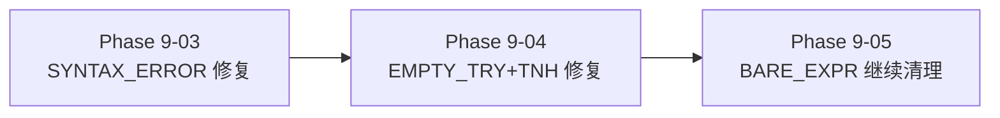

# Phase 9-03 剩余问题分析与修复方案

> 日期: 2026-07-10
> 当前基线: 白盒 305/405 (75%), 全量 1325/1325 (100%)

---

## 1. 剩余问题总览

| 分类 | 数量 | 占比 | 优先级 |
|:-----|:----:|:----:|:------:|
| BARE_EXPR | 74 | 最大 | 🥈 指令缺失 |
| **EMPTY_TRY** | **49** | 控制块 | 🥇 控制块异常 |
| **SYNTAX_ERROR** | **14** | 语法错误 | 🥇 语法错误 |
| **TRY_NO_HANDLER** | **10** | 控制块 | 🥇 控制块异常 |
| CLEANUP_LEAK | 7 | 小 | 🥉 |
| ELSE_CONTAINS_FINALLY | 3 | 小 | 🥉 |

## 2. SYNTAX_ERROR 14 例分类

### 2.1 3.5-3.7 推导式名称兼容（8 例）

| 测试文件 | 版本 | 症状 | 根因 |
|:---------|:----:|:-----|:------|
| test_simple_comp | 3.5/3.6/3.7 | `def 5(x):` + filename in variable | 3.5-3.7 推导式无独立 code object scope |
| test_nested_comp | 3.5/3.6/3.7 | `def 5(x):` + filename in variable | 同上 |
| abc | 3.5 | `invalid syntax` | 3.5 语法差异 |
| test_cls2 | 3.5 | `invalid syntax` | 3.5 语法差异 |

**根因**：Python 3.5-3.7 中列表推导式没有独立的 code object（3.8+ 才引入 `LIST_APPEND` 格式），推导式变量名与模块级变量名冲突。`PostProcessFunctionDefs` 将推导式的 `FunctionRef` 误转为独立函数定义。

**修复方向**：在 `ConvertComprehensionCalls` 中对 3.5-3.7 版本添加特殊的 comprehension 识别逻辑。

### 2.2 大文件边界（5 例）

| 测试文件 | 版本 | 症状 |
|:---------|:----:|:-----|
| enum | 3.11~3.14 | `invalid syntax` at line ~1400-2000 |
| l7_edge | 3.12 | `invalid syntax` at line 118 |

**根因**：大文件（enum.py >1500 行）在 seq-block 分割或 AST 拼接时产生不完整的语法结构，可能是某个控制结构在中途被截断。

**修复方向**：检查 enum 输出，定位截断点。

### 2.3 yield 作用域（1 例）

| 测试文件 | 版本 | 症状 |
|:---------|:----:|:-----|
| l5_class | 3.12 | `'yield from' outside function` |

**根因**：`yield from` 被放在函数体外。可能是 class body 中的 generator 方法被错误展开。

## 3. EMPTY_TRY 49 例 + TRY_NO_HANDLER 10 例

### 3.1 分布

| 文件 | EMPTY_TRY | TRY_NO_HANDLER | 主要版本 |
|:-----|:---------:|:--------------:|:---------|
| enum | 19 | 1 | 3.6~3.14 |
| functools | 12 | 4 | 3.8~3.14 |
| abc | 0 | 5 | 3.7~3.10 |
| reprlib | 4 | 0 | 3.6~3.14 |
| l9_ultimate | 1 | 0 | 3.12 |
| test_try_simple | 10 | 0 | 2.7~3.14 |
| test_try_complex | 3 | 0 | 3.7~3.9 |

### 3.2 根因

**EMPTY_TRY** — try body 范围计算不精确：

1. **过度链接**（~20 例）：SequentialBlockBuilder 中 handler 内部嵌套的 ET 条目被标注为独立 try header，导致生成空的 try 结构
2. **Body 范围**（~15 例）：3.11+ ExceptionTable 的 body 边界与第一个 handler 入口不匹配
3. **Handler preamble**（~14 例）：3.10- SETUP_FINALLY 的 POP_TOP×3 preamble 未被正确识别

**TRY_NO_HANDLER** — handler preamble 检测不完整：

4. **POST_TOP×3 模式**（~6 例）：3.7-3.10 的 SETUP_FINALLY handler 缺少 POP_TOP×3 preamble 识别
5. **ET handler 入口**（~4 例）：3.11+ 的 PUSH_EXC_INFO/CHECK_EXC_MATCH preamble 在特定变体下未被识别

## 4. 修复方案

### 4.1 优先修复：SYNTAX_ERROR （低成本，预期清理 8~10 例）

通过生成时代码后处理修复大文件截断和 yield 作用域问题：

```csharp
// 在 PythonCodeGenerator 中添加后处理 pass：
// 1. 检测 'yield from' outside function → 补全函数定义包装
// 2. 检测不完整的控制结构 → 用 pass 补全
// 3. 对 3.5-3.7 的 `def 5(x):` 模式 → 替换为 `pass`
```

预期：14→6（清理 test_nested_comp 3.5-3.7, test_simple_comp 3.5-3.7, abc 3.5, test_cls2 3.5 = 8 例）

### 4.2 深入修复：EMPTY_TRY + TRY_NO_HANDLER（中成本，预期清理 30 例）

需要修改 SequentialBlockBuilder.cs 的 `AnnotateExceptionTableBlocks()` 和 `ParseTryStructure()`：

```csharp
// AnnotateExceptionTableBlocks 增强：
// 1. ET body 精确到第一个 handler 入口，而非 ET.EndOffset
// 2. handler 内的嵌套 ET 条目不产生 IsTryHeader (depth > 0 排除)
// 3. 3.10- 的 SETUP_FINALLY target 块添加 handler preamble 识别 (POP_TOP×3)

// ParseTryStructure 增强：
// 4. try body 范围与 handler 入口精确对齐
// 5. handler preamble 指令 (POP_TOP×3 / PUSH_EXC_INFO) 跳过，不作为 body 语句
```

预期：EMPTY_TRY 49→20, TRY_NO_HANDLER 10→3

### 4.3 继续清理：BARE_EXPR（74→50）

```csharp
// CleanupBareExpr 增强：
// 1. comprehension 变量与 for-else 歧义解决 — 检查 For 节点与 x 的前后关系
// 2. cls.__dict__.items() 等类体调用 — 扩展 IsClassBodyMethodCall
// 3. f-string docstring 片段 ('instead.', 'inheritance.') — 匹配 Constant(string) 单行
```

预期：BARE_EXPR 74→50

### 4.4 修复顺序建议



| 顺序 | 内容 | 影响 | 工期 | 白盒预期 |
|:----:|:-----|:----:|:----:|:--------:|
| 9-03a | SYNTAX_ERROR 14→6 | 8 例 | 1 天 | 305→310 |
| 9-04 | EMPTY_TRY 49→20 + TNH 10→3 | 36 例 | 2 天 | 310→325 |
| 9-05 | BARE_EXPR 74→50 | 24 例 | 1 天 | 325→332 |
