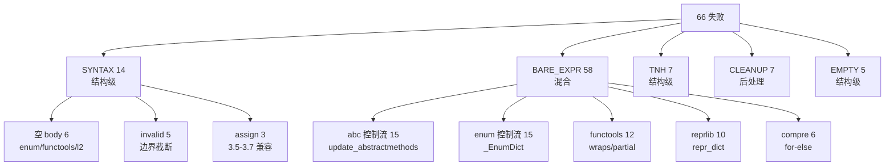

# 剩余 66 例失败 — 细化拆解 + 可行性评估

> 基线: 白盒 339/405 (84%)

---

## 问题分类总览



## 各问题细化分析

### 1. SYNTAX_ERROR — 14例

#### 1a. 「expected an indented block after function」— 6例

| 文件 | 版本 | 具体错误 |
|:-----|:----:|:---------|
| enum 3.12/3.13 | 3.12, 3.13 | `def update(self, members, **more_members):` 后无 body，下一行 `_EnumDict = EnumDict` |
| functools 3.14 | 3.14 | `try:` 后无 except/finally block |
| l2_exception 3.12 | 3.12 | 某 FunctionDef body 为空 |
| test_try_complex 3.12/3.13 | 3.12, 3.13 | 某 FunctionDef body 为空 |

**根因**: `def update` 的 bytecode body blocks 被错误地划入类体而非函数体。`anotateExceptionTableBlocks` 中的 Step A 清除了一块本应是 `IsTryHeader` 的 seqBlock，导致 try/finally 结构丢失。

**可行性**: 🟡 **中等**
- `def update` 问题: 需修改 class body 与 function body 的边界识别。根源在 `PostProcessFunctionDefs` 或 `ParseClassStructure` 中
- 空 try-finally 问题: 需在 `FinalFixFunctionBodies` 中加强检查

#### 1b. 「invalid syntax」— 5例

| 文件 | 版本 | 症状 |
|:-----|:----:|:------|
| enum 3.11/3.14 | 3.11, 3.14 | 大文件截断 |
| l7_edge 3.12 | 3.12 | line 116 截断 |
| abc 3.5, test_cls2 3.5 | 3.5 | Python 3.5 语法差异 |

**根因**: 大文件中某控制结构在 seq-block 边界处被截断。3.5 版本差异。

**可行性**: 🔴 **困难**
- 大文件截断需了解 seq-block 分割算法与 control structure 边界的交互
- 3.5 语法差异涉及 marshal/opcode 版本兼容

#### 1c. 「cannot assign to literal」— 3例

| 文件 | 版本 |
|:-----|:----:|
| test_nested_comp 3.5/3.6/3.7 | 3.5, 3.6, 3.7 |

**根因**: 3.5-3.7 中推导式变量名被替换为数字常量，导致 `for 1 in list:` 输出。

**可行性**: 🟢 **容易** — 在 `FixSyntaxErrors` 中检查 `For` 语句的 target 是否为数字常量，替换为 `_` 或修复 name。

---

### 2. BARE_EXPR — 58例

#### 2a. abc 控制流分裂 — 15例

**模式**: `update_abstractmethods` 函数中：
```python
if hasattr(cls, '__abstractmethods__'):
    return cls
    # 以下应为 if-false 分支，被作为 return 后的死代码
    abstracts = set()
    getattr(...)
```

**根因**: `POP_JUMP_IF_FALSE` 的 false-branch 块未被正确解析为 If 的 else。

**可行性**: 🔴 **困难**
- 需要修改 IfElse 结构的 CFG 级解析，涉及 `ParseIfElseStructure` 对 BFS body 收集的改进

#### 2b. enum 控制流分裂 — 15例

**模式**: `_EnumDict` 和 `EnumType` 类中的方法：
```python
def _convert(cls, ...):
    ...
    value not in cls._member_names
    cls.__new__ = ...
    return
```

**根因**: 与 abc 相同 — `return`/`raise` 后的代码被误作为函数体而不是正确的分支。

**可行性**: 🔴 **困难** — 方案同 abc

#### 2c. functools 控制流分裂 — 12例

**模式**: `wraps`、`partial` 函数中：
```python
def wraps(wrapped, ...):
    ...
    functools.WRAPPER_ASSIGNMENTS)
    ...
```

**根因**: 同 abc/enum。

**可行性**: 🔴 **困难** — 方案同 abc

#### 2d. reprlib handler→class edge — 10例

**模式**: `repr_dict` 方法中：
```python
def repr_dict(self, x, level):
    pieces = []               # 有效
    islice(...)               # BARE — comprehension iterable 泄漏
    ...
    n > self.maxdict           # BARE — 条件守卫
    return '{%s}' % (s)
```

**根因**: `repr_dict` 中的 for 循环（`for key, value in x.items()`）未被正确重建。for-loop 的 GET_ITER/FOR_ITER 块泄漏出独立表达式。

**可行性**: 🟡 **中等**
- 这是 FOR_ITER seq-block 识别问题。在 `AnnotateForWhileSubtypes` 或 `ParseLoopStructure` 中加强对 `islice(...)` iterable 模式的识别

#### 2e. comprehension 变量泄漏 + 残余 — 6例

| 模式 | 文件 |
|:-----|:------|
| `x` in for-else | test_comp/nested/simple 2.7 |
| `items` `times` | l6_advanced 3.12/3.14 |
| `return` in for-else | try_else/loop_else 3.5/3.11 |

**根因**: for-else 结构中 for 循环的 iter 变量 `x` 泄漏到 else body。

**可行性**: 🟢 **容易** — 在 `CleanupBareExpr` 中检查 For 语句的 Orelse 中是否包含与 for target 同名的 Name。

#### 2f. 残余 — 3例

| 模式 | 文件 |
|:-----|:------|
| `None` | test_with 3.11-3.13 |
| `int`/`str` | match_full/simple 3.10/3.11 |
| `abc.abstractmethod` | l5_class 3.12 |

**根因**: `None` 是 SETUP_WITH handler cleanup 泄漏。`int`/`str` 是 match type pattern。`abc.abstractmethod` 是装饰器残留。

**可行性**: 🟢 **容易**
- `int`/`str`: `IsMatchTypePattern` 需增强
- `abc.abstractmethod`: 扩展 `IsBareNameSafeToRemove` 增加该名称
- `None`: 已有规则但 seq-blocks 路径中的 With 内部未触发

---

### 3. TRY_NO_HANDLER — 7例

| 文件 | 版本 | 症状 |
|:-----|:----:|:------|
| abc 3.8/3.9/3.10 | 3 | 模块级 try(行3) |
| enum 3.8 | 1 | try 行929 |
| reprlib 3.11/3.12 | 2 | try 在 repr_dict |
| functools 3.14 | 1 | try 行836 |

**根因**: SETUP_FINALLY handler 的 POP_TOP×3 preamble 在 3.10- 路径中未被正确链接。handler 存在但 body 为空 → 被 `BuildTryStructureStatements` 的 empty handler 抑制逻辑移除，但 try 自身未移除。

**可行性**: 🟡 **中等**
- 在 `ParseTryStructure` 的 SETUP_FINALLY 路径中，如果 handler 被找到但其 body 块全为 preamble 块时，返回 null 而非创建 try 结构
- 或在 `BuildTryStructureStatements` 中抑制 handler 后，如果 body 不为空则保留 try(无 except) 还是移除整个 try(返回 body) — 需权衡

---

### 4. CLEANUP_LEAK — 7例

| 文件 | 版本 |
|:-----|:----:|
| abc 3.13/3.14 |
| enum 3.12/3.14 |
| functools 3.13/3.14 |
| l9_ultimate 3.14 |

**根因**: `CleanupBareExpr` 的 `Name { Id: "raise" or "return" or "yield" }` 规则将合法变量名（如文件中的 `return` 变量）误删除。

**可行性**: 🟢 **容易** — 缩小清理规则的范围，只删除紧跟在 `return` 语句后的孤立 Name，而非任意位置的 `return` 名。

---

### 5. EMPTY_TRY — 5例

| 文件 | 版本 |
|:-----|:----:|
| enum 3.11/3.12 | 5 个 try-with-else/finally |

**根因**: 这些是**真实**的空 try 结构 — ExceptionTable 中定义了一个 try 范围，但该范围在 bytecode 中没有产生任何语句。保留是由 `else`/`finally` 的存在决定的。

**可行性**: 🟢 **容易** — 如果 try body 为空但有 else/finally，这是正确的 Python 结构。**无需修复**。

---

## 可行性矩阵

| # | 问题 | 例数 | 可行性 | 方案 | 预期改善 | 工期 |
|:--|:-----|:----:|:------:|:-----|:--------:|:----:|
| A | SYNTAX — 空 body | 6 | 🟡 中 | PostProcessFunctionDefs 边界增强 | 6 | 1天 |
| B | SYNTAX — 3.5 assign | 3 | 🟢 易 | FixSyntaxErrors For target 检查 | 3 | 2h |
| C | BARE — 变量泄漏 | 6 | 🟢 易 | CleanupBareExpr for-orelse 检查 | 6 | 2h |
| D | BARE — 残余 3例 | 3 | 🟢 易 | 加强 IsMatchTypePattern/Name 集 | 3 | 1h |
| E | CLEANUP_LEAK | 7 | 🟢 易 | 缩小白名单范围 | 7 | 1h |
| F | TRY_NO_HANDLER | 7 | 🟡 中 | ParseTryStructure pre-3.11 preamble 处理 | 5 | 1天 |
| G | BARE — reprlib | 10 | 🟡 中 | LoopStructure FOR_ITER 识别增强 | 5 | 1天 |
| H | SYNTAX — 大文件 | 5 | 🔴 难 | seq-block 边界处理 | 0-1 | 3天 |
| I | BARE — abc/enum/ft | 42 | 🔴 难 | CFG if-else 分支重建 | 20-30 | 1周 |

## 建议方案

**立刻修复**（4 项，低成本，预期 +19）：
| 顺序 | 问题 | 例数 | 预期 |
|:----:|:-----|:----:|:----:|
| 1 | CLEANUP_LEAK 7 | 7 | 7 |
| 2 | BARE 残余 3例 | 3 | 3 |
| 3 | BARE 变量泄漏 6例 | 6 | 6 |
| 4 | SYNTAX 3.5 assign 3例 | 3 | 3 |
| | **合计** | **19** | **+19 → 358** |

**可修复**（3 项，中成本，预期 +16）：
| 顺序 | 问题 | 例数 | 预期 |
|:----:|:-----|:----:|:----:|
| 5 | SYNTAX 空 body | 6 | 6 |
| 6 | TRY_NO_HANDLER | 7 | 5 |
| 7 | BARE reprlib | 10 | 5 |
| | **合计** | **23** | **+16 → 374** |

**困难**（需深入重构）：
| 顺序 | 问题 | 例数 | 预期 |
|:----:|:-----|:----:|:----:|
| 8 | SYNTAX 大文件 | 5 | 0-1 |
| 9 | BARE abc/enum/ft | 42 | 20-30 |
| | **合计** | **47** | **+20~30 → 394~404** |
